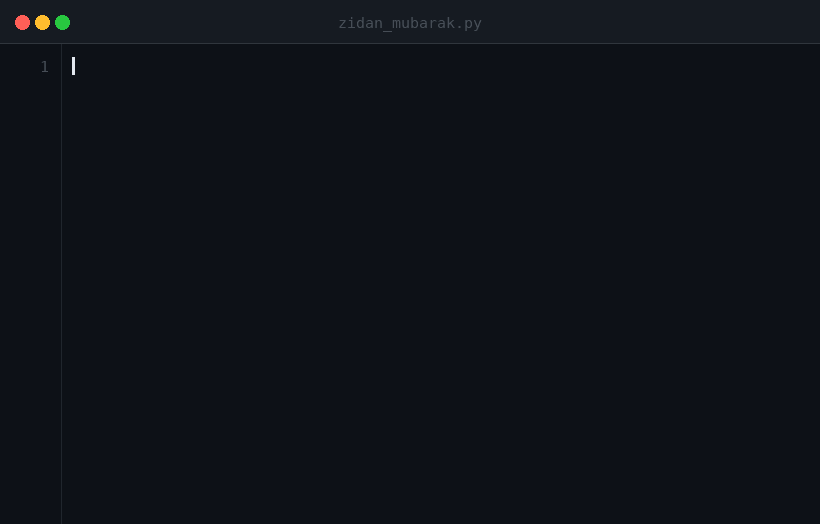

   
  
   
   
  

    
    
    
  

  

    &nbsp;&nbsp;&nbsp;
    &nbsp;&nbsp;&nbsp;
  

---

### 👨‍💻 About Me

  <!--  -->
  

### 🛠️ Tech Stack & Tools

<table align="center" width="100%">
  <tr>
    <td align="center" width="50%">
      <b>🤖 AI & Data Science</b>  
      &nbsp;&nbsp;
      &nbsp;&nbsp;
      &nbsp;&nbsp;
      &nbsp;&nbsp;
      &nbsp;&nbsp;
      &nbsp;&nbsp;
      &nbsp;&nbsp;
      
    </td>
    <td align="center" width="50%">
      <b>💻 Languages & Tools</b>  
      &nbsp;&nbsp;
      &nbsp;&nbsp;
      &nbsp;&nbsp;
      &nbsp;&nbsp;
      &nbsp;&nbsp;
      &nbsp;&nbsp;
      &nbsp;&nbsp;
      
    </td>
  </tr>
</table>

### 📊 GitHub Analytics

<!-- 

  
  

 -->

<table align="center" width="100%">
  <tr>
    <td align="center" width="45%">
      
    </td>
    <td align="center" width="55%">
      
    </td>
  </tr>
</table>

### 🐍 Contribution Activity

  <picture>
    <source media="(prefers-color-scheme: dark)" srcset="https://raw.githubusercontent.com/zidanmubarak/zidanmubarak/output/github-contribution-grid-snake-dark.svg"/>
    <source media="(prefers-color-scheme: light)" srcset="https://raw.githubusercontent.com/zidanmubarak/zidanmubarak/output/github-contribution-grid-snake.svg"/>
    
  </picture>

   
  ⭐ <b>Feel free to star my repositories if you find them helpful!</b> ⭐  
  © 2026 Zidan Mubarak • Thanks for visiting! 🚀

